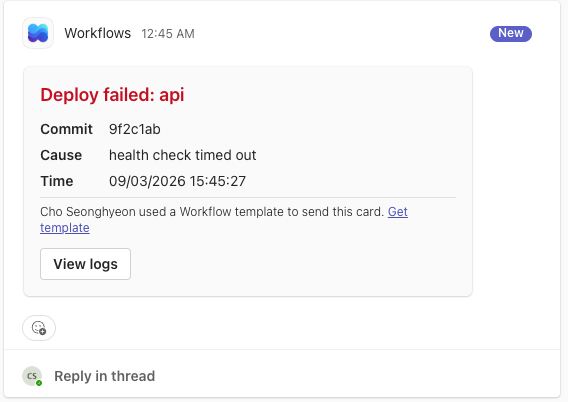
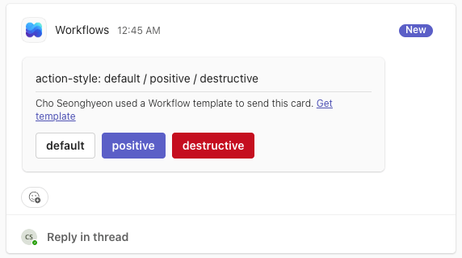
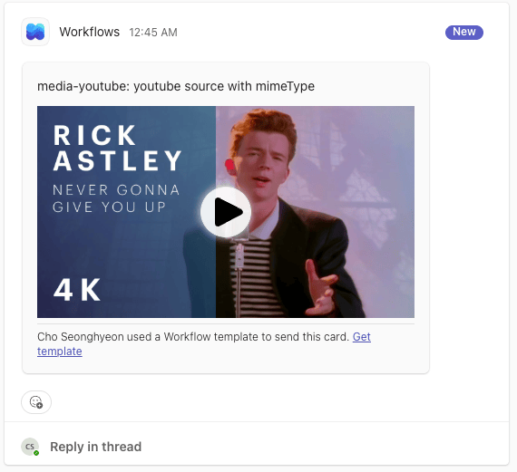

# teams4j

Adaptive Cards and Microsoft Teams for the JVM. Build a card in Java or Kotlin, check it against
what Teams actually renders, and post it to a channel through a Workflows webhook.

**Documentation: <https://teams4j.github.io/teams4j/>**

> [!NOTE]
> Unofficial community project. Not affiliated with, sponsored by, or endorsed by Microsoft.

<p align="center">
  
  
  
</p>

## Quick look

```java
WorkflowsWebhookClient teams = WorkflowsWebhookClient.create(System.getenv("TEAMS_WEBHOOK_URL"));

teams.send(Cards.webhookCard()
        .text("Deploy failed: api", t -> t.weight(FontWeight.BOLDER).color(Colors.ATTENTION))
        .facts(f -> f.add("Commit", sha).add("Cause", cause))
        .openUrl("View logs", logUrl));
```

```kotlin
val card = adaptiveCard {
    body {
        textBlock("Deploy failed: api") { weight = FontWeight.BOLDER; color = Colors.ATTENTION }
        factSet { fact("Commit", sha); fact("Cause", cause) }
    }
    webhookActions { actionOpenUrl("View logs", logUrl) }
}
teams.sendAwait(card)
```

Around that one call the client validates the card against the Teams profile, checks the 28 KB
limit, paces to four requests per second, and retries 429 and 5xx with backoff. Each of those
came from a measurement on a real tenant, not from the documentation.

- **Teams constraints in the type system.** `Action.Submit` does not work in a webhook card, so a
  webhook card cannot be given one, at compile time in Java and Kotlin. What types cannot reach,
  the validator checks before every send.
- **Zero runtime dependencies.** The card model binds to no JSON library and the client speaks
  JDK `HttpClient`. Bring Jackson or kotlinx.serialization.
- **One JSON from two DSLs.** The Java builder and the Kotlin DSL are generated from the same schema,
  and a test proves they emit the same JSON.

## Getting started

Java 17+. 0.1.0 is not on Maven Central yet; until then, `./gradlew publishToMavenLocal` from a
clone and `mavenLocal()` in your build.

```kotlin
// Spring Boot: one dependency, one property (teams4j.webhook.url)
implementation("io.github.teams4j:teams4j-webhook-spring-boot-starter:0.1.0")

// Plain Java: the client plus the JSON binding you already use
implementation("io.github.teams4j:teams4j-webhook:0.1.0")
implementation("io.github.teams4j:teams4j-cards-jackson:0.1.0")
```

- [Getting started](https://teams4j.github.io/teams4j/guide/getting-started) — webhook URL, dependency, first card
- [Deploy notification in five minutes](https://teams4j.github.io/teams4j/cookbook/deploy-notification) — the Spring Boot walkthrough
- [Building cards](https://teams4j.github.io/teams4j/guide/cards) · [Validation](https://teams4j.github.io/teams4j/guide/validation) · [The webhook client](https://teams4j.github.io/teams4j/guide/webhook)
- [Teams limits](https://teams4j.github.io/teams4j/reference/limits) and [Measurements](https://teams4j.github.io/teams4j/reference/measurements) — what was sent to a real tenant and what came back
- [`examples/`](examples) — runnable Java, Kotlin coroutines and Spring Boot projects

## Modules

| Module | What it does |
|---|---|
| `teams4j-cards` | Adaptive Cards model and Java builder DSL. Zero runtime dependencies |
| `teams4j-cards-kotlin` | Kotlin type-safe DSL |
| `teams4j-cards-jackson` | Jackson binding |
| `teams4j-cards-kotlinx` | kotlinx.serialization binding |
| `teams4j-teams` | Teams limits and `TeamsProfileValidator` |
| `teams4j-webhook` | Posts cards to a Workflows webhook. Zero runtime dependencies |
| `teams4j-webhook-kotlin` | Coroutine `sendAwait` |
| `teams4j-webhook-spring-boot-starter` | Spring Boot auto-configuration |
| `teams4j-bom` | Version alignment |

Java 17+, Kotlin 2.0+ for the Kotlin modules, Spring Boot 3.5.x and 4.1.x for the starter,
Adaptive Cards 1.5. The [compatibility page](https://teams4j.github.io/teams4j/guide/compatibility)
has the full table.

## Roadmap

Not started, and waiting on demand: Microsoft Graph messaging, the bot side (Activity Protocol and
Bot Connector), and a routing framework on top of it. The webhook client is outbound only; receiving
anything from Teams belongs to those future modules.

## Building

```bash
./gradlew build
./gradlew generateModel   # regenerate the model and Kotlin DSL from the schema; CI checks for drift
```

Built with a Java 21 toolchain, targeting Java 17 bytecode. `mise.toml` selects the JDK if you use `mise`.

## License

Apache License 2.0.
